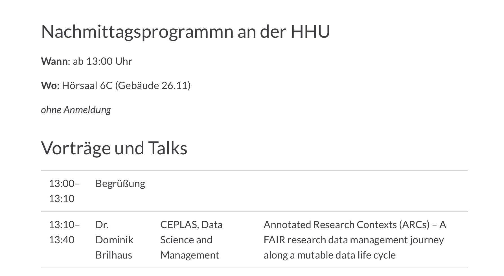
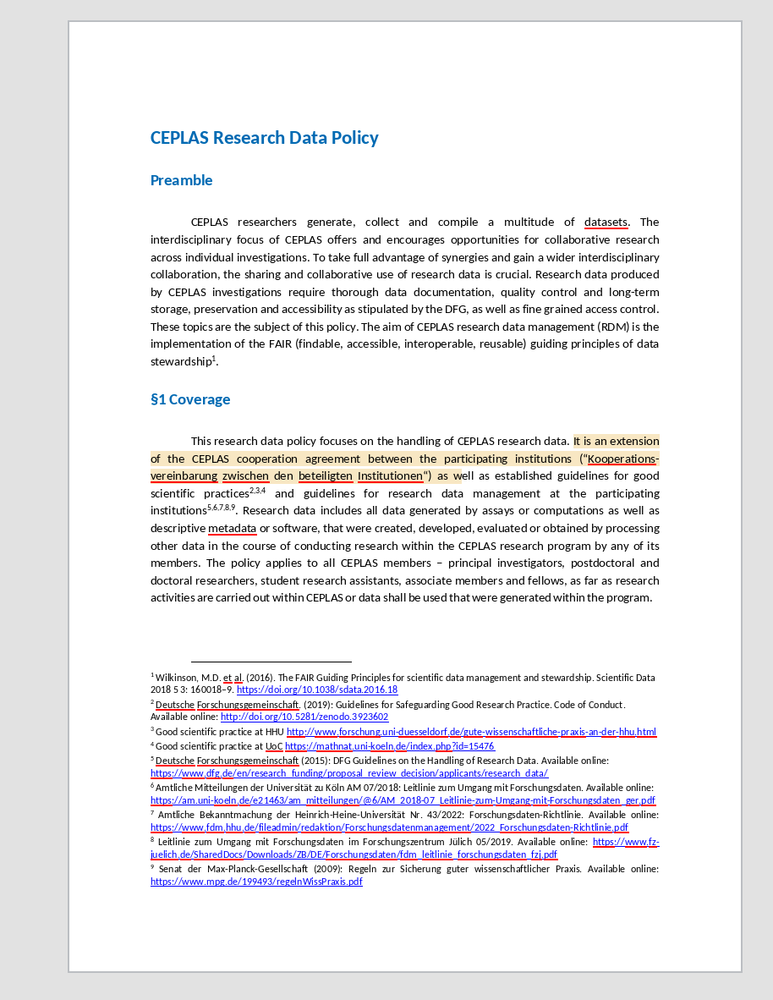

# CEPLAS research data management (RDM)

<!-- _paginate: false -->

 

Steering Committee Meeting
October 27th, 2023

Dominik Brilhaus, [CEPLAS Data Science](https://www.ceplas.eu/en/research/data-science-and-data-management/)

---

# Goals of CEPLAS RDM

- share data
- share resources
- collaborate

---

# Avoid Scattered Data Silos

---

# Roadmap

1. Agree on an RDM system
2. Build use-cases and templates
3. Train researchers
4. Start sharing

---

# How to store data &ndash; ARCs

ARC = Annotated Research Context

---

# Where to share data &ndash; DataHUB

The <a href="https://git.nfdi4plants.org" target="_blank">DataHUB</a> is a federated platform for ARCs

 Weil, H.L., Schneider, K., et al. (2023), PLANTdataHUB: a collaborative platform for continuous FAIR data sharing in plant research. Plant J. https://doi.org/10.1111/tpj.16474 

---

# ARC ecosystem demo @ *Tag der Forschungsdaten* <!-- fit -->

November 14th, 2023

https://www.fdm.hhu.de/veranstaltungen/tag-der-forschungsdaten-in-nrw-2023

---

# CEPLAS research data policy

*To be circulated in SC soon* (> [current version](https://uni-duesseldorf.sciebo.de/apps/onlyoffice/721579600?filePath=%2FCEPLAS-data-policy%2FCEPLAS-data-policy.docx))

- §1 Coverage
- §2 Legal framework conditions
- §3 Handling of research data
- §4 Responsibilities
  - Data delivery
  - Data access
  - Data selection
  - Data use
  - Training
- §5 Validity and governance

---

# ARC entry points

##### Workshops and lab hackathons

##### Case studies

##### Core facilities

##### Resource ARCs

---

# What I need from you

1. Lighthouse projects
   1. Mainly CEPLAS-funded
   2. Cross-lab / Cross-RA collaborations
   3. CEPLAS researchers still present, active and willing to polish ARC
2. Appointments for lab Hackathons
   1. Sit together two days to create ARCs
3. Your backing "My boss said..."

---

# Available dates

for lab hackathons

- Nov 15th & 16th (Wed + Thu)
- Nov 22nd & 23rd (Wed + Thu)
- Nov 30th & Dec 1st (Thu + Fri)
- Nov 7th & Dec 8th (Thu + Fri)

---

# Lab Hackathons

- Good internet connection
- Isolated from lab // office // daily duties
- Access to the data to be ARCified
(file share, hard disks)
- Agile, communicative, collaborative, positive
- Technical *ad-hoc* support by DataPLANT

:bulb: [ARC Club (@HHU Plant Biochemistry)](https://nfdi4plants.org/nfdi4plants.knowledgebase/docs/teaching-materials/disseminations/2023-06-28_ARC-Club_HHU/)

---

# Case studies

- Create ARCs from CEPLAS publications
- Publish CEPLAS data as ARCs

:bulb: [Publication to ARC](https://nfdi4plants.org/nfdi4plants.knowledgebase/docs/guides/publicationToARC.html)

:bulb: [ARC Data Publications](https://nfdi4plants.org/nfdi4plants.knowledgebase/docs/DataHUB-Manual/datahub-data-publications.html)

---

# Core facilities / enabling platforms

- Help with switch towards ARC ecosystem
- Create templates
- Create use-cases

:bulb: [ARCs in Enabling Platforms](https://nfdi4plants.org/nfdi4plants.knowledgebase/docs/guides/ARC-enablingPlatforms.html)

---

# Data of common interest: resources

In addition to ***research data***, which CEPLAS resources do we want to share and catalog?

 

- Identify standards
- Identify / build databases
- Create templates

---

# Network

We're connecting to other consortia using ARCs

- TRR341, https://trr341.uni-koeln.de/ 
- CRC1535, https://www.sfb1535.hhu.de/ 
- FAIRagro, https://www.fairagro.net/ 
  -  IPK -> TransCend
- NFDI4BioImage, https://nfdi4bioimage.de/  

---

# Resources

###  DataPLANT (nfdi4plants)

Website: <a href="https://nfdi4plants.org/" target="_blank">https://nfdi4plants.org/</a>
Knowledge Base: <a href="https://nfdi4plants.org/nfdi4plants.knowledgebase/" target="_blank">https://nfdi4plants.org/nfdi4plants.knowledgebase/</a>
DataHUB: <a href="https://git.nfdi4plants.org" target="_blank">https://git.nfdi4plants.org</a>
GitHub: <a href="https://github.com/nfdi4plants" target="_blank">https://github.com/nfdi4plants</a>
